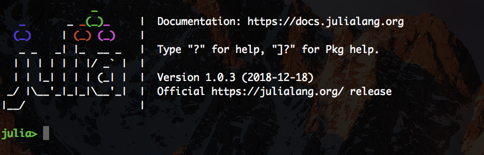

# Jupyter Notebook (Accessing class materials)

All class materials are available via jupyter notebooks. Here we provide a simple guide to accessing them.

## Install Julia

To get started, you first need to install Julia (if you haven't already).

 - Download and install Julia v1.0.3 from [https://julialang.org/downloads/](https://julialang.org/downloads/).

## Download the materials

To get the class materials [download this zip file](https://github.com/LAMPSPUC/Teaching.jl/archive/master.zip) and uncompress it to a folder of your choice. This will create a sub-folder `Teaching.jl-master` with all the materials.

## Open Julia

Now open Julia by clicking on the Julia icon you installed. Once open, you should be faced with the Julia *REPL* (Julia's interactive command prompt) that looks like this:



## Install Jupyter

Now we need to install [Jupyter](http://jupyter.org/).
In the Julia REPL, run the following commands (this may take a little bit of time):
```julia
import Pkg
ENV["JUPYTER"]=""
Pkg.add("Conda")
Pkg.add("IJulia")
import Conda
Conda.add("jupyter")
```

## Open a Jupyter notebook

Okay, last step, let's launch a Jupyter notebook! Open a Julia REPL and then run:
```julia
using IJulia
IJulia.notebook()
```

If all goes well, a browser window will open that looks like this:


You can then navigate to the location of where you uncompressed the `Teaching.jl-master` repository folder and navigate to the class of your choice


To get started on the class, click on the first notebook entitled `Linear Classification.ipynb`.


### Using the Default Packages in a Class

The files `Project.toml` and `Manifest.toml` contain the information about versions of the default tutorial packages that we know work well. These packages can be _activated_ by running the following code in any Jupyter notebook in the `Teaching.jl-master` folder:
```julia
import Pkg
Pkg.activate(@__DIR__)
Pkg.instantiate()
```
You will see this as the first code cell in all notebooks and you should add it to all the notebooks you create.